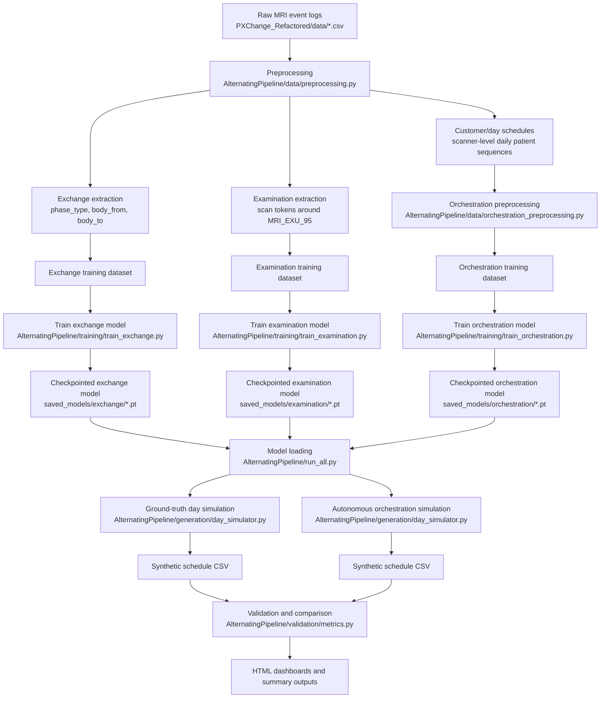
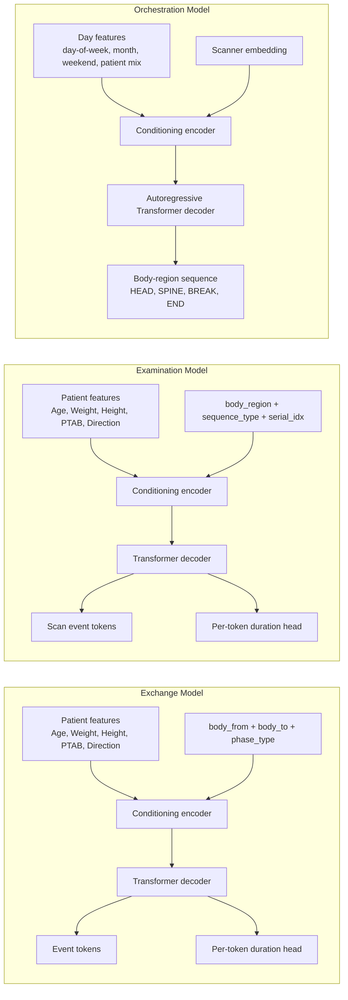
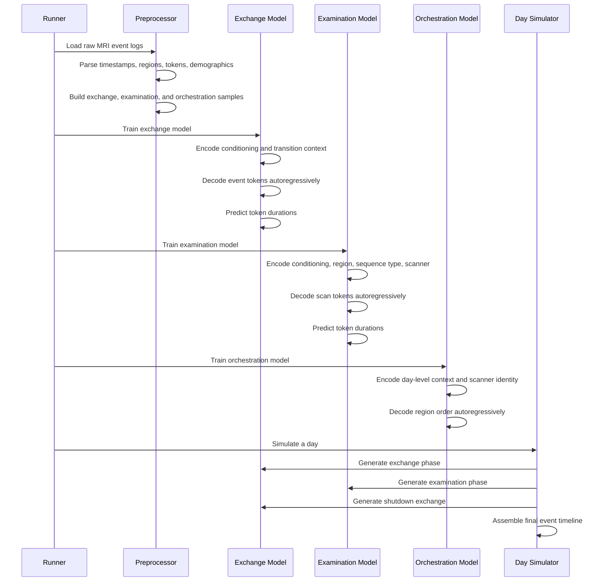

# MRI Digital Twin Workflow and Model Mechanics

## Scientific Overview

This document describes the end-to-end workflow of the `AlternatingPipeline` project, including data preprocessing, model training, inference, and validation. The system is designed to emulate MRI operational behavior by decomposing a full day into alternating phases of:

1. exchange/setup events,
2. examination/scan events,
3. orchestration-level day sequencing.

The implementation combines conditional sequence modeling with temporal feature encoding and scanner-specific context. Exchange and examination phases are generated by a shared Transformer-based sequence generator, while day-level planning is handled by a dedicated orchestration Transformer.

## 1. End-to-End Workflow

The first figure summarizes the full pipeline, from raw event logs through preprocessing, training, simulation, and evaluation.



### Workflow interpretation

- Raw MRI logs are parsed into structured temporal records.
- Exchange sequences represent setup, repositioning, and teardown activity around scans.
- Examination sequences represent the scan itself, centered on the `MRI_EXU_95` marker.
- Orchestration samples capture day-level body-region order, breaks, scanner identity, and coarse temporal context.
- Each training step produces a checkpointed model for inference.
- Day generation either follows a known patient list or is driven by orchestration output.
- Validation compares synthetic and real schedules using duration and event-distribution metrics.

## 2. Model Working Principle

The second figure explains how the three model families operate internally.



### Exchange model

The exchange model predicts the event sequence associated with a body-region transition. Its conditioning signal includes:

- patient covariates: age, weight, height, PTAB, direction,
- temporal covariates: hour-of-day, weekday, morning indicator, cyclical encodings,
- transition context: `body_from`, `body_to`, and `phase_type`.

It produces:

- token logits over MRI event symbols,
- duration parameters for each generated token.

### Examination model

The examination model predicts the scan sequence within a body region. Its conditioning signal includes:

- patient covariates,
- temporal covariates,
- body region identity,
- sequence type,
- scanner serial index.

It produces:

- scan event tokens,
- duration parameters for the generated scan span.

### Orchestration model

The orchestration model generates the body-region order for a day. It uses:

- day-of-week and month features,
- weekend indicator,
- historical patient-volume statistics,
- body-region distribution per scanner,
- scanner embedding.

It outputs a sequence over:

- body regions,
- `BREAK`,
- `START`,
- `END`.

## 3. Operational Sequence

The third figure gives a procedural view of how a single simulated day is produced.



### Generation logic

For each patient or orchestration token:

1. The exchange model generates setup or transition events.
2. The examination model generates the scan block.
3. The exchange model generates the final teardown or inter-patient transition.
4. Timestamps are accumulated from predicted durations.
5. The result is exported as a structured CSV schedule.

## 4. Reference Implementation

The code below is a standalone reference implementation intended for documentation purposes only. It is not meant to be pasted into the repository automatically.

```python
"""
Standalone MRI workflow reference implementation.

This file summarizes the project logic in a compact, readable form:
- preprocessing
- model training
- day simulation
- validation
"""

from dataclasses import dataclass
from typing import Any, Dict, List


@dataclass
class Patient:
    patient_id: str
    body_region: str
    age: float = 50.0
    weight: float = 75.0
    height: float = 1.75
    direction: str = "Head First"


def preprocess_raw_mri_logs(raw_csv_paths: List[str]) -> Dict[str, Any]:
    """
    Parse raw MRI event logs into trainable sequence datasets.

    Outputs:
        - exchange sequences
        - examination sequences
        - customer schedules for orchestration
    """
    return {
        "exchange": [],
        "examination": [],
        "customer_schedules": {},
    }


def train_exchange_model(exchange_sequences):
    """
    Train the conditional exchange Transformer.
    """
    return {"model_type": "exchange"}


def train_examination_model(examination_sequences):
    """
    Train the conditional examination Transformer.
    """
    return {"model_type": "examination"}


def train_orchestration_model(day_samples):
    """
    Train the day-level orchestration Transformer.
    """
    return {"model_type": "orchestration"}


def simulate_day_with_ground_truth(patients: List[Patient]):
    """
    Simulate a full MRI day using a known patient list.
    """
    schedule = []
    previous_region = "START"

    for idx, patient in enumerate(patients):
        phase_type = "startup" if idx == 0 else "between"

        schedule.append({
            "event_type": "exchange",
            "body_from": previous_region,
            "body_to": patient.body_region,
            "phase_type": phase_type,
        })

        schedule.append({
            "event_type": "examination",
            "body_region": patient.body_region,
        })

        previous_region = patient.body_region

    if patients:
        schedule.append({
            "event_type": "exchange",
            "body_from": previous_region,
            "body_to": "END",
            "phase_type": "shutdown",
        })

    return schedule


def simulate_day_from_orchestration(orchestration_tokens, demographic_distributions):
    """
    Simulate a full day from orchestration output alone.
    """
    return []


def compare_real_vs_predicted(real_schedule, predicted_schedule):
    """
    Compute schedule-level validation metrics.
    """
    return {}


if __name__ == "__main__":
    raw = preprocess_raw_mri_logs([])
    exchange_model = train_exchange_model(raw["exchange"])
    examination_model = train_examination_model(raw["examination"])
    orchestration_model = train_orchestration_model([])

    patients = [
        Patient("PAT001", "HEAD"),
        Patient("PAT002", "SPINE"),
        Patient("PAT003", "PELVIS"),
    ]

    schedule = simulate_day_with_ground_truth(patients)
    print(exchange_model, examination_model, orchestration_model)
    print(schedule)
```

## 5. Implementation Notes

- The exchange and examination models share a common Transformer generator backbone.
- The orchestration model is separate because it operates at a different abstraction level and uses scanner-level conditioning.
- Temporal features are encoded cyclically to preserve periodic structure.
- Duration modeling is explicitly learned rather than assigned by fixed heuristics.
- Validation is intended to compare real and synthetic distributions rather than exact event-by-event matching.

## 6. Project-Level Reading Guide

- [Pipeline runner](./AlternatingPipeline/run_all.py)
- [Central configuration](./AlternatingPipeline/config.py)
- [Core preprocessing](./AlternatingPipeline/data/preprocessing.py)
- [Orchestration preprocessing](./AlternatingPipeline/data/orchestration_preprocessing.py)
- [Sequence generator backbone](./AlternatingPipeline/models/sequence_generator.py)
- [Exchange model](./AlternatingPipeline/models/exchange_model.py)
- [Examination model](./AlternatingPipeline/models/examination_model.py)
- [Orchestration model](./AlternatingPipeline/models/orchestration_model.py)
- [Exchange training](./AlternatingPipeline/training/train_exchange.py)
- [Examination training](./AlternatingPipeline/training/train_examination.py)
- [Orchestration training](./AlternatingPipeline/training/train_orchestration.py)
- [Day simulation](./AlternatingPipeline/generation/day_simulator.py)
- [Validation metrics](./AlternatingPipeline/validation/metrics.py)

## 7. Summary

This architecture provides a layered MRI workflow model:

- local event generation at the exchange and examination levels,
- global day planning at the orchestration level,
- schedule-level validation against historical data.

The result is a scientifically structured digital twin framework for MRI operational simulation.
