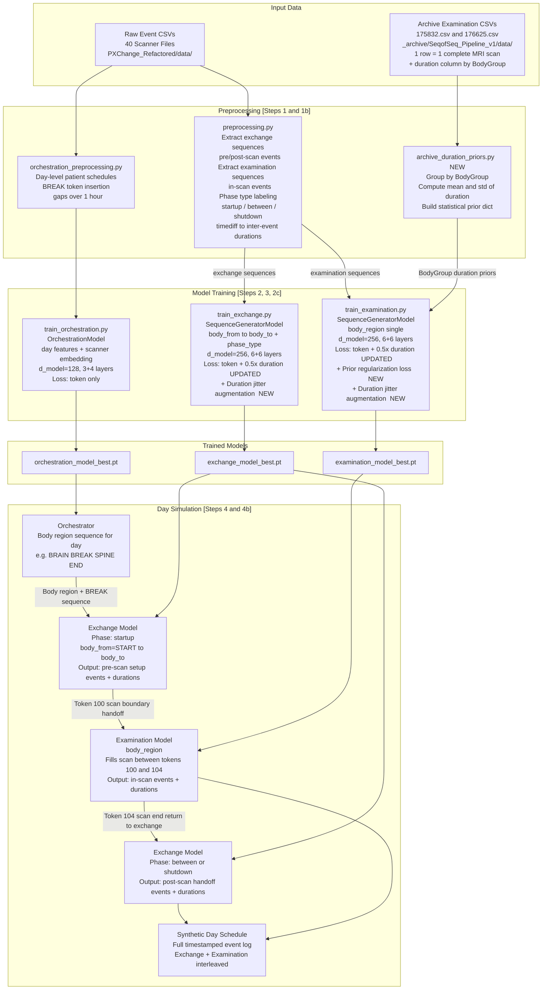

# Pipeline Architecture

Full data flow for the MRI event sequence generation pipeline.

## Model Interlock

The Exchange and Examination models are trained separately but interlock seamlessly during simulation:

- **Token 100** (`MRI_MSR_100` = Start Prepare): Exchange emits this as the final token before handing off to the Examination model
- **Token 104** (`MRI_MSR_104` = Measurement Finished OK): Examination emits this as its terminal token, returning control to the Exchange model
- The Day Simulator watches for these boundary tokens and switches active models accordingly
